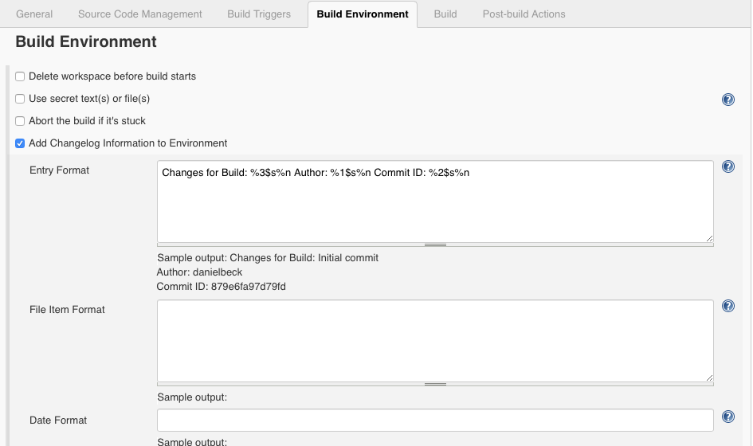
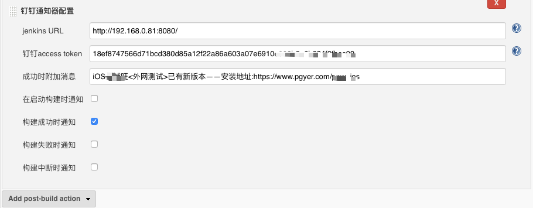
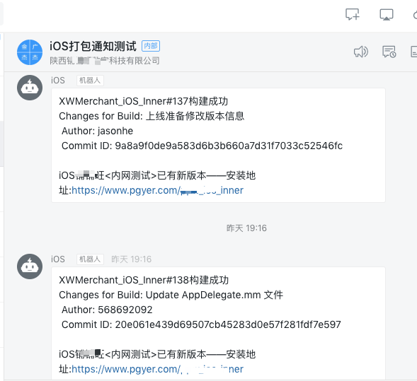

# Jenkins 钉钉自定义消息通知插件 
Jenkins钉钉配置插件可以让你的build结果第一时间反馈到你所在的工作群中， 帮助你了解build状况
### 本项目基于官方项目https://github.com/jenkinsci/dingding-notifications-plugin修改而来，主要增加自定义消息输入栏目，增加项目变更日志信息，方便测试人员了解当次构建更新内容。
### 项目依赖于changelog-environment.hpi-插件，该插件项目中已包含可以直接下载使用

## 如何使用 

0. 在编译环境中勾选 changelog-environment 插件 ，设置日志输出样式

例如：Changes for Build: %3$s%n Author: %1$s%n Commit ID: %2$s%n

1. 创建钉钉机器人 

钉钉 -> ... -> 机器人管理 

保存 最后一个参数accesstoken

2. 配置Jenkins 
当你拿到钉钉群机器人的accessToken后， 在每一个job之后，你都可以选择添加'钉钉配置通知器'

~~input the access token in previous step, and please input the Jenkins URL~~
~~填入accessToken， 以及很重要的： 填上你Jenkins的URL，因为Jenkins自己不知道自己的URL是什么~~

新版本钉钉插件在创建通知时会自动获取一次Jenkins的ROOT URL，所以如果这里你能看到，就不用再填写ROOT URL了（版本1.3+）

3. Enjoy!

